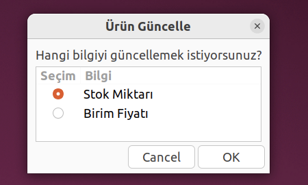
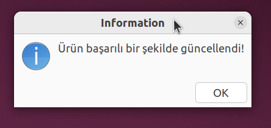
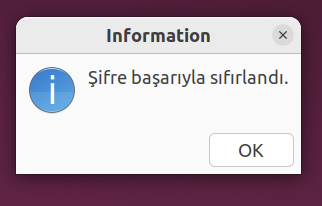

# Zenity ile Basit Envanter Yönetim Sistemi


Proje, Zenity ve bash script kullanılarak geliştirilmiş basit bir envanter yönetim sistemi uygulamasıdır. Kullanıcı dostu bir arayüz ile depo yönetimi, kullanıcı işlemleri gibi temel işlevleri yerine getirebilecek şekilde tasarlanmıştır.

## Özellikler

- **Kullanıcı Rolleri:**
  - Yönetici: Ürün ekleyebilir, güncelleyebilir, silebilir ve kullanıcıları yönetebilir.
  - Kullanıcı: Ürünleri görüntüleyebilir ve rapor alabilir.

- **Veri Saklama:**
  - `depo.csv`: Ürün bilgilerini saklar.
  - `kullanici.csv`: Kullanıcı bilgilerini saklar.
  - `log.csv`: Hata kayıtlarını saklar.
  - `yedek_depo.csv`: Ürün bilgilerinin yedeklerini saklamak için kullanılır.
  - `yedek_kullanici.csv`: Kullanıcı bilgilerinin yedeklerini saklamak için kullanılır.    
- **Ana Menü Seçenekleri:**
  - **Ürün Ekle**: Yeni ürün ekleyebilirsiniz.
  - **Ürün Listele**: Mevcut ürünlerinizi listeleyebilirsiniz.
  - **Ürün Güncelle**: Mevcut ürünlerin bilgilerini güncelleyebilirsiniz.
  - **Ürün Sil**: Bir ürünü sistemden silebilirsiniz.
  - **Rapor Al**: 
    - **Stokta Azalan Ürünler**: Eşik değeri sağlanan ve stokta azalan ürünlerin raporunu alabilirsiniz.
    - **En Yüksek Stok Miktarına Sahip Ürünler**: En yüksek stok miktarına sahip ürünlerin raporunu alabilirsiniz.
  - **Kullanıcı Yönetimi**: 
    - **Yeni Kullanıcı Ekle**: Sisteme yeni kullanıcı ekleyebilirsiniz.
    - **Kullanıcıları Listele**: Sistemdeki tüm kullanıcıları listeleyebilirsiniz.
    - **Kullanıcı Güncelle**: Mevcut kullanıcıların bilgilerini güncelleyebilirsiniz.
    - **Kullanıcı Sil**: Sistemdeki bir kullanıcıyı silebilirsiniz.
    - **Kullanıcı Şifresini Sıfırla**: Kullanıcı şifresini sıfırlayabilirsiniz.
    - **Kilitli Hesapları Aç**: Kilitlenmiş hesapları açabilirsiniz.
  - **Program Yönetimi**:
    - **Diskteki Alanı Göster**: Proje dosyalarının disk üzerindeki alan kullanımını görüntüleyebilirsiniz.
    - **Diske Yedekle**: Veri dosyalarını yedekleyebilirsiniz.
    - **Hata Kayıtlarını Göster**: Sistemdeki hata kayıtlarını görüntüleyebilirsiniz.
  - **Çıkış**: Sistemi kapatabilir ve çıkabilirsiniz.
    
 ## Kurulum

 ### Gereksinimler

 Bu projeyi çalıştırabilmek için aşağıdaki yazılımlar gereklidir:

 - **Zenity**: Grafiksel kullanıcı arayüzü pencereleri oluşturmanıza olanak tanır.
 - **Bash**: Bu proje, bash script ile yazılmıştır ve genellikle Linux sistemlerde varsayılan olarak gelir.

 ### Adım Adım Kurulum

 1. **Depoyu Klonlayın**  
    GitHub üzerindeki projeyi bilgisayarınıza klonlamak için terminalde aşağıdaki komutu çalıştırın:
    ```bash
    git clone https://github.com/zeyneperarslan/envanteryonetimsistemi.git

 2. **Proje Klasörüne Gidin**
    Klonladığınız projeye gitmek için şu komutu kullanın:
    ```bash
    cd envanteryonetimsistemi
   
 3. **Çalıştırılabilir İzinler Verin**
    Projeyi çalıştırmak için gerekli izinleri vermek amacıyla şu komutu kullanın:
    ```bash
    chmod +x genel_ekran.sh

 4. **Projeyi Başlatın**
    Şimdi projeyi çalıştırabilirsiniz. Aşağıdaki komut ile uygulamayı başlatın:
    ```bash
    ./genel_ekran.sh

   **Uyarı:** Zenity Yüklenmemişse
     Eğer Zenity sisteminizde yüklü değilse, aşağıdaki komutla yükleyebilirsiniz:
  ```bash
    sudo apt-get install zenity
```
## Kullanım Adımları

### 1. Giriş Ekranı
Uygulamayı çalıştırdığınızda ilk olarak hoşgeldiniz mesajı karşılaşacaksınız:


Ardından Kullanıcı Adı ve Şifre Giriş Ekranı kullanıcının karşısına çıkacaktır.

 
- **Kullanıcı Adı**: Kaydedilmiş kullanıcı adı girilir.
- **Şifre**: Şifre girilir.

OK butonuna tıkladığınızda, doğru bilgileri girerseniz ana menüye yönlendirilirsiniz. Hatalı giriş yapmanız durumunda bir uyarı mesajı alırsınız:

---

### 2. Ana Menü
Başarılı giriş yaptığınızda, aşağıdaki ana menüye yönlendirilirsiniz: Ana menüde kullanıcıya 8 seçenek sunulur.


Buradan kullanıcı istediği işlemi seçebilir.

### Ana Menü Seçenekleri

### 1. Ürün Ekleme
**"Ürün Ekle"** seçeneğine tıklandığında aşağıdaki form ekranı açılacaktır:


Bu ekranda:
- **Ürün Adı**: Ürünün ismi girilir. Eğer arada boşluk varsa kullanıcı uyarılır ve tekrar giriş istenir.
- **Miktar**: Stok miktarı girilir. Stok miktarı pozitif sayı olmalıdır.
- **Birim Fiyat**: Ürünün birim fiyatı girilir. Birim fiyatı pozitif sayı olmalıdır.
- **Kategori**: Ürünün kategorisi girilir.Kategori alanı boş bırakılmamalıdır.

**Kaydet** butonuna basıldığında ürün envantere eklenecektir.

---

### 2. Ürün Listeleme
**"Ürün Listele"** seçeneğine tıkalndığında envanterdeki tüm ürünler görüntülenir:


Burada tüm ürünler numaraları küçükten büyüğe sıralanmış şekilde adı,stok miktarı,birim fiyatı ve kategorisi ile birlikte listelenir.

---

### 3. Ürün Güncelleme
**"Ürün Güncelle"** seçeneğine tıklandığında ilk olarak güncellenmek istenen ürün girişi çıkar.


Ardından seçilen ürünün hangi özelliğinin güncellenmek istediği radio list formatında kullanıcıya sunulur.



Kullanıcının yaptığı seçim üzerine güncel sayının girilmesi istenir.


Tüm işlemler tamamlandıktan sonra ürünün güncellendiğine dair bilgilendirme mesajı verilir.



---

### 4. Ürün Silme
**"Ürün Sil"** seçeneğine tıklandığında istenen bir ürün envanterden kaldırılır.


Kullanıcıdan silmek istenen ürün girişi alınır.


Ardından silmek istediğine dair bir onay alınır.


Eğer onay verilirse silme işlemi tamamlanır ve kullanıcıya bilgi verilir.

### 5. Rapor Al
**"Rapor Al"** seçeneğine tıklandığında kullanıcının seçimine göre envanterdeki stoğu azalan ürünleri ya da yüksek stok miktarındaki ürünler listelenir.


 **Stoğu azalan Ürünler** seçilirse ilk olarak kullanıcıdan eşik değer istenir ardından stok miktarı eşik değerine yakın olan ürünler listelenir.

  

 **En Yüksek Stok Miktarına Sahip Ürünler** seçilirse ilk olarak kullanıcıdan eşik değer istenir ardından stok miktarı eşik değerinin üstünde olan ürünler listelenir.

  

### 6. Kullanıcı Yönetimi
**"Kullanıcı Yönetimi"** seçeneğine tıklandığında sadece Yöneticinin erişiminde olan işlemler sunulur.


Yönetici rolünde olan kullanıcı seçeneklerden birini seçer.

#### Yeni Kullanıcı Ekle 
**"Yeni Kullanıcı Ekle"** seçeneği seçilirse uygulamaya yeni kullanıcı ekleme işlemi yapılır.

 

Yeni kullanıcının sırasıyla kullanıcı adı , soyadı , rolü ve şifresi zenity pencerisiyle yöneticiden istenir. Yukarıda sadece "Kullanıcı Adı" girişi verilmiştir diğer bilgi girişleri de aynı şekildedir.


Yeni kullanıcının tüm bilgileri girildikten sonra bilgilendirme mesajı verilir.

#### Kullanıcıları Listele
**"Kullanıcıları Listele"** seçeneği seçilirse var olan kullanıcı listesi görüntülenir.


#### Kullanıcı Güncelle
**"Kullanıcı Güncelle"** seçeneği seçilirse istenen kullanıcının bilgileri güncellenir.

 

Güncellenmek istenen kullanıcının  sırasıyla kullanıcı adı , soyadı , rolü ve şifresi güncellenir. Yukarıda sadece "Soyadı" güncelleme girişi verilmiştir diğer güncelleme işlemleri de aynı şekildedir.


Yönetici kullanıcı güncelleme işlemlerini tamamladığında bilgilendirme mesajı verilir.

#### Kullanıcı Sil
**"Kullanıcı Sil"** seçeneği seçilirse istenen kullanıcıya ait hesap uygulamadan silinir.

 

Yöneticiden silmek istediği kullanıcı adı istenir.


Ardından silmek istediğine dair onayı alınır.


Onay doğrulanırsa bilgilendirme mesajı verilir.

#### Kullanıcı Şifresini Sıfırla
**"Kullanıcı Şifrresini Sıfırla"** seçeneği seçilirse istenen kullanıcın şifresi sıfırlanır.

 

İlk olarak yöneticiden şifresini sıfırlamak istediği kullanıcı adı alınır.

 

Ardından seçilen kullanıcının yeni şifresi girilir.

 

İşlemler tamamlandıktan sonra şifrenin sıfırlandığına dair bilgilendirme mesajı verilir.

#### Kilitli Hesapları Aç
**"Kullanıcı Şifrresini Sıfırla"** seçeneği seçilirse yönetici var olan kilitli hesapların açılmasını sağlar.

 

İlk olarak kilidi açılmak istenen kullanıcı adı istenir.

 

Eğer girilen kullanıcı adına sahip hesap kilitli ise tekrardan açılmasına dair onay istenir.

 

Hesap kilidi açma işlemi tammalandığında açıldığına dair bilgilendirme mesajı verilir.

### 7. Program Yönetimi
**"Program Yönetimi"** seçeneğine tıklandığında disk yönetimi ile ilgili seçenekler listelenir.

 

Kullanıcı seçeneklerden birini seçer.

#### Diskteki Alanı Göster
**"Diskteki Alanı Göster"** seçeneği seçildiğinde diskteki boş ve kullanılan alan görüntülenir.

 

#### Diske Yedekle
**"Diske Yedekle"** seçeneği seçildiğinde kullanici.csv ve depo.csv dosyaları yedeklenir. Yeni yedek_kullanici.csv ve yedek_depo.csv dosyaları oluşturulur.Ardından yedeklendiğine dair bilgilendirme mesajı verilir.

 

#### Hata Kayıtlarını Göster
**"Hata Kayıtlarını Göster"** seçeneği seçildiğinde diskle ilgili hata kayıtlarını içeren log.csv dosyası okunur ve içeriği listelenir.

 

### 8. Çıkış Yap
**"Çıkış Yap"** seçeneğine tıklandığında kullanıcı uygulamadan çıkış yapar.

 

Çıkış yapmak istediğine dair onayı alınır. Onay verilirse çıkış işlemi gerçekleştrilir.


